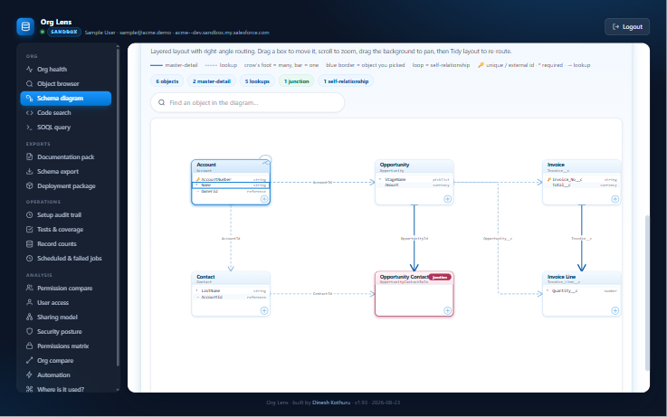
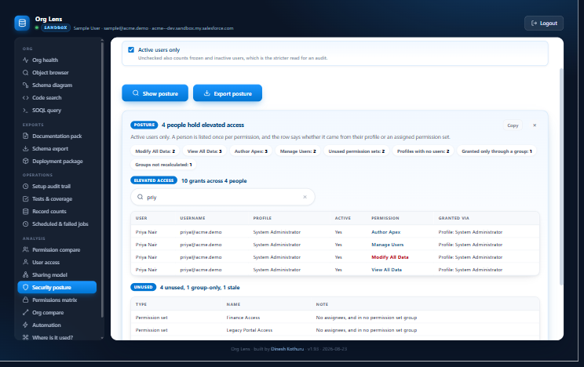
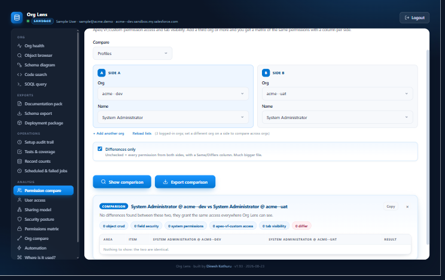
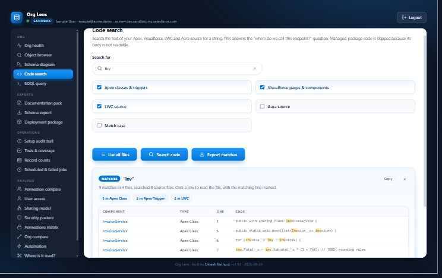
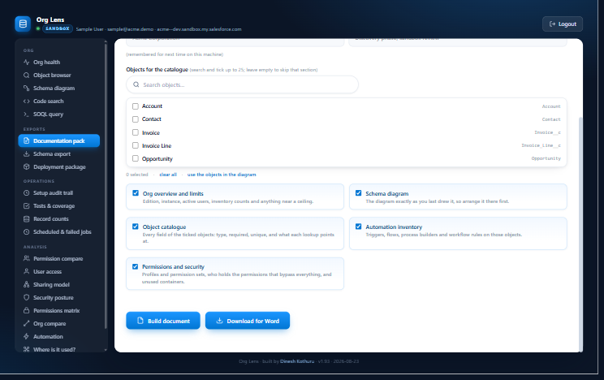
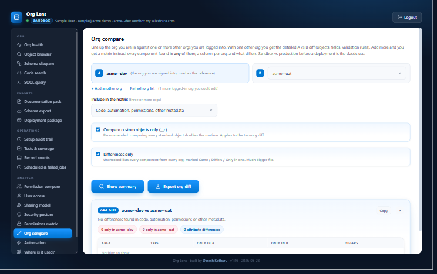

# Org Lens

A Chrome extension that reads a Salesforce org and answers the questions Setup makes hard:
what the schema looks like, who can see what, what automation fires, and what nothing
references any more. Twenty panels, every result exportable to Excel, and a one-press
document you can hand to a client.

**No setup in the org.** It uses the session of a Salesforce tab you are already signed into,
so there is nothing to configure or install on the Salesforce side.

**Read-only.** Every panel queries; nothing writes back. Nothing is stored, sent or logged
anywhere — see [Security](#security).

Created out of personal interest, to have these in one place. Try it at your own
discretion.

Built by Dinesh Kothuru.

---

## Screenshots

Sample org, so nothing here is a real customer's data.

**Schema diagram** — crow's-foot notation, master-detail solid and lookups dashed, junction
objects flagged, exportable to SVG, PNG or PDF.

**Security posture** — who can bypass sharing, and whether the permission came from a profile,
a permission set or a permission set group.

**Profile and permission set compare** — two sides in one org or across orgs; add a third and
it becomes a matrix.

**Code search** — grep every class, trigger, LWC and Aura bundle, then click a hit to read the
file with the matching line marked.

**Documentation pack** — one press, one branded document: overview, diagram, object catalogue,
automation and permissions.

**Org compare** — two orgs as a detailed diff, or three to eight as a matrix.

---

## Install

1. Download this repo: **Code → Download ZIP**, then extract to a folder you will keep
   (the extension runs from that folder, so deleting it uninstalls the tool).
2. Open `chrome://extensions` and turn on **Developer mode**, top right.
3. **Load unpacked** → select the extracted folder.
4. Pin the Org Lens icon to the toolbar.
5. Sign into any Salesforce org in another tab, then click the icon.

`setup.html` in this folder is a fuller walkthrough of every panel — open it in a browser.

To update: extract the new files over the same folder, then press the refresh arrow on the
extension's card in `chrome://extensions`.

---

## What it does

**Explore**
- **Org health** — limits and usage the moment you connect, a live component inventory, and
  the full limits table sorted by whatever sits closest to its ceiling
- **Object browser** — objects, fields, record types, field-level access, org-wide defaults
- **Schema diagram** — a real ERD: layered layout, right-angle routing, crow's-foot
  cardinality, master-detail solid and lookups dashed, junction objects flagged, and lines
  that hop where they cross. Drag boxes, undo, find, export SVG / PNG / PDF with a title block
- **Code search** — grep every Apex class, trigger, Visualforce page, LWC and Aura bundle;
  click a hit to read the whole file with the matching line marked
- **SOQL query** — autocomplete over the org's real fields, relationship traversal, and an
  "all fields" expansion

**Export**
- **Documentation pack** — one branded document, as HTML to print or a file Word opens: org
  overview, the schema diagram, an object catalogue with every field, the automation on those
  objects, and the permissions picture
- **Schema export** — objects, fields, picklists, validation rules and code inventory to Excel
- **Deployment package** — components changed since a date as `package.xml`, plus a full
  Metadata API sweep that zips `package.xml` with an inventory of every component, its
  last-modified date and its author

**Operations**
- **Setup audit trail**, **Tests & coverage** (including which test covers each class),
  **Record counts**, **Scheduled & failed jobs**

**Analysis**
- **Permission compare** — two profiles or permission sets, in one org or across orgs; add a
  third side and it becomes a matrix
- **User access** — one user's effective access, and where each grant comes from
- **Sharing model** — org-wide defaults per object, the role hierarchy, groups and queues, and
  what is actually granting access: Apex sharing reasons, restriction and scoping rules, and
  real share-row counts by cause
- **Security posture** — who can Modify All Data, View All Data, Author Apex or Manage Users,
  and whether it came from a profile, a permission set or a permission set group, plus the
  containers nobody uses
- **Permissions matrix** — object CRUD and field-level security across profiles
- **Org compare** — two orgs as a detailed diff, or three to eight as a matrix
- **Automation** — everything that fires on an object, in evaluation order
- **Where is it used?** — what references a field, object, class, flow, label or component,
  before you change it
- **Field usage** — how populated each field is, and which fields are both empty and
  unreferenced

---

## Security

The reason to trust this is that it is checkable, not that I say so.

- **No external network calls.** There are exactly two `fetch` calls in the code, and both
  target the Salesforce host your session belongs to: one for the REST and Tooling APIs, one
  for the Metadata API. No `XMLHttpRequest`, no `sendBeacon`, no WebSocket, no analytics. The
  only other URLs are a LinkedIn link, this repo, and three XML namespace strings, which are
  identifiers rather than requests.
- **No server, no analytics, no telemetry.** There is nowhere for data to go.
- **Read-only.** Queries and describes only. Nothing is created, updated or deleted.
- **Nothing sent anywhere, and almost nothing kept.** Your session id never leaves the
  browser. To survive a page refresh it is held in `sessionStorage`, which is scoped to that
  one tab and cleared when you close it. `chrome.storage.local` holds four things, none of
  them org data: your saved SOQL queries, your saved diagram arrangements, the cover details
  for the documentation pack, and which panel you last had open. Everything else — describes,
  records, permissions, source — lives in page memory and dies with the tab.
- **No remote code.** `xlsx.full.min.js` (SheetJS, for Excel) and `elk.bundled.js` (diagram
  layout) are vendored in this repo. Neither makes a network call: SheetJS has no network
  primitives at all, and elk's worker is inlined rather than fetched. Manifest V3's content
  security policy blocks remote scripts in any case.
- **Nothing outside Salesforce is reachable.** No content scripts, no
  `externally_connectable`, no `web_accessible_resources`, and host permissions limited to
  five Salesforce domains.

### Permissions, and why each exists

| Permission | Why |
|---|---|
| `cookies` | reads the `sid` session cookie of Salesforce hosts, which is how it authenticates as you |
| `storage` | your preferences: saved queries, diagram layouts, document cover details |
| `tabs` | lists the orgs you are signed into, so you can choose between them |
| `host_permissions` on Salesforce domains | the API calls themselves |

It cannot read any non-Salesforce site: the host permissions name only Salesforce domains.

---

## API usage

Every panel spends API calls, so it is worth knowing which are cheap and which are not. All
figures are per run, against your org's daily request allowance.

| Panel | Roughly what it costs |
|---|---|
| Org health, audit trail, jobs, coverage, security posture, sharing model | a handful of calls each |
| Object browser | one describe per object you open |
| Schema diagram, schema export | one describe per selected object |
| Code search | one query per source type, but the payloads are large: it downloads source to grep it |
| Record counts | one aggregate per object |
| **Field usage and unused fields** | **one aggregate per field** — the heaviest panel here, so keep the object selection small |
| Export all metadata | around 50 to 70 Metadata API calls, more on an org with many report folders |
| Documentation pack | the sum of the sections you tick |

For scale: an Enterprise org's daily allowance runs into the millions, and a typical session
here is a few hundred calls. The exception is field usage across many objects at once, which
is why that panel caps the selection.

**Org health shows your remaining allowance**, so you can watch the cost as you work: press
*Show all limits* and look at Daily Api Requests.

## Limits worth knowing

- Some things no API exposes, so they are reported as absent rather than guessed: sharing rule
  criteria, sharing sets, implicit sharing, layout assignments, translations.
- The Dependency API behind **Where is it used?** is a Salesforce beta with partial coverage,
  so an empty result is not proof that something is unused.
- Managed-package code cannot be read, and shows as unavailable.
- A few panels need **View Setup and Configuration**; they say so rather than failing silently.

---

## Status

In daily use, but young: tested against a handful of orgs, not hundreds. If a panel breaks or
a number looks wrong, please open an issue with the panel name and the exact message. That
kind of report has already fixed several real bugs.

## Licence

MIT — see [LICENSE](LICENSE).
